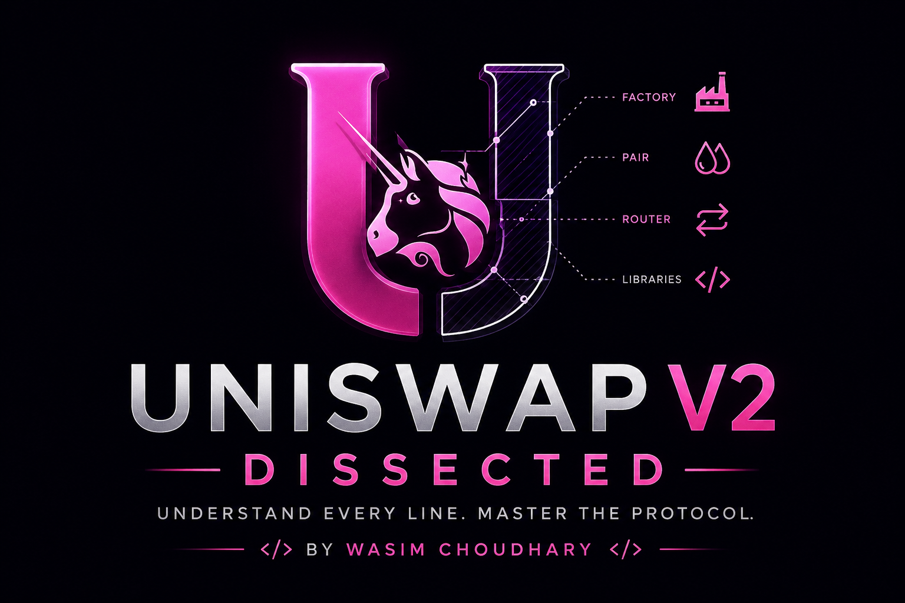

<div align="center">

# 🚀 Uniswap V2 — Reverse Engineering, Dissection & Modern Solidity Implementation



[](https://github.com/Uniswap/v2-core)
[](https://github.com/Uniswap/v2-periphery)
[](https://soliditylang.org/)
[](https://x.com/i___wasim)
[](https://www.linkedin.com/in/wasim-007-choudhary/)
[](https://github.com/wasim007choudhary)


</div>

---

> **"If you want to truly understand DeFi, understand Uniswap V2."**

A complete reverse engineering and educational reconstruction of **Uniswap V2**, rewritten in **Solidity 0.8.20**, while preserving the protocol's original architecture, mathematics, and design philosophy.

This repository is **not** another copy of the Uniswap V2 source code.

It is the result of an extensive reverse engineering journey where every contract, every function, every branch, every formula, every storage variable, every gas optimization, every invariant, every protocol decision, and every subtle implementation detail has been dissected until nothing remained unexplained.

The goal was simple:

> **Never look at Uniswap V2 again and wonder *"Why did they do this?"***

Every question that came up during the journey was answered, documented, and connected back to Ethereum, the EVM, Solidity internals, AMM mathematics, and protocol design.

Years from now, this repository should allow me to return, open any file, and immediately reconstruct the complete mental model behind one of the greatest smart contract codebases ever written.

---

# 📖 About This Repository

Most Uniswap V2 repositories explain **what** the code does.

Very few explain **why**.

This repository focuses on both.

Throughout this project I intentionally slowed down the learning process, often spending hours—or even days—understanding a single function before moving to the next.

Instead of simply reading the implementation, I questioned every line of code.

Examples include:

* Why is this variable cached?
* Why is this operation performed before another?
* Why is `balance` used instead of `reserve`?
* Why is `√k` used instead of `k`?
* Why does this branch exist?
* Why is the protocol fee implemented this way?
* What would happen if this line were removed?
* Which EVM behavior makes this implementation correct?
* Why was this the most gas-efficient solution?
* Could this have been written differently?
* What assumptions does the protocol rely on?

Every one of those questions—and hundreds more—has been answered throughout this repository.

---

# 🎯 Project Goals

This repository was built to:

* Reverse engineer Uniswap V2 from first principles.
* Understand every single line of the protocol.
* Learn the mathematics behind Automated Market Makers (AMMs).
* Understand the EVM-level reasoning behind each implementation decision.
* Preserve the elegance of the original protocol while modernizing it for Solidity **0.8.20**.
* Create a long-term reference that can be revisited years later without having to relearn everything from scratch.

---

# ⚙️ Modernization

The original Uniswap V2 was written in Solidity **0.5.16** and **0.6.6**.

This repository has been modernized for **Solidity 0.8.20** while preserving the protocol's behavior as closely as possible.

Some improvements include:

* Modern Solidity syntax.
* Solidity 0.8 built-in overflow and underflow protection.
* Custom Errors instead of long revert strings where appropriate.
* Cleaner naming for readability.
* Extensive NatSpec documentation.
* Additional comments explaining protocol decisions.
* Improved readability without changing protocol behavior.
* Minor gas optimizations where modern Solidity makes them possible.

These changes are intended to improve developer experience while respecting the design of the original implementation.

---

# 📚 Documentation

The documentation is the heart of this repository.

Rather than placing every explanation directly inside the code, the project is divided into dedicated learning resources.

### 📂 `notes/`

This directory contains the complete reverse engineering journey.

Every contract, function, mathematical derivation, protocol invariant, implementation decision, gas optimization, EVM behavior, Solidity concept, edge case, misconception, design trade-off, and breakthrough encountered during the dissection has been documented here.

The notes are written as a long-term knowledge base rather than simple study notes.

If I revisit this repository years later, the notes should immediately reconstruct the complete mental model behind the protocol.

---

### 📂 `contracts/coreUV2/`

The core protocol contracts contain extensive NatSpec documentation.

Every important function includes explanations covering:

* Purpose
* Execution flow
* Internal logic
* Storage interactions
* Gas optimizations
* Security considerations
* Mathematical reasoning
* Protocol assumptions
* Edge cases
* Revert conditions

---

### 📂 `contracts/peripheryUV2/`

The Router and Periphery contracts are documented with the same level of detail.

The NatSpec documentation explains:

* Complete execution flow
* Contract interaction sequence
* Router responsibilities
* Parameter reasoning
* Internal helper functions
* Why each step exists
* Design decisions
* Expected protocol behavior

Together, the codebase and documentation form a complete educational reference rather than simply another implementation of Uniswap V2.

---
# ✨ What Makes This Repository Different?

There are countless repositories that reimplement or fork **Uniswap V2**.

This repository was built with a very different objective.

The goal was **not** simply to recreate the protocol.

The goal was to completely understand it.

Throughout this journey, I intentionally slowed the learning process down and refused to move forward until every line of code made sense.

That meant constantly asking questions such as:

* Why was this implementation chosen?
* Why is this calculation correct?
* Why is this variable cached?
* Why is the order of execution important?
* Why is this operation performed before another?
* Why is this storage variable updated here?
* What protocol invariant does this preserve?
* What EVM behavior makes this safe?
* What would break if this line were removed?
* Is there a more gas-efficient implementation?
* Why didn't the original developers choose that approach instead?

Every one of those questions became part of the documentation.

Nothing was accepted simply because "that's how Uniswap does it."

Everything was broken down, verified, challenged, and reconstructed from first principles.

---

## 🔬 Reverse Engineering Approach

This repository focuses on understanding the protocol at multiple layers simultaneously.

### Protocol Layer

Understanding **what** Uniswap V2 is trying to achieve.

* Automated Market Makers (AMMs)
* Liquidity Pools
* Liquidity Providers
* LP Tokens
* Constant Product Formula
* Protocol Fees
* Price Discovery
* Flash Swaps
* Oracle Accumulators
* Reserve Management
* Arbitrage expectation

---

### Mathematical Layer

Understanding **why the formulas work**.

Instead of memorizing equations, every formula is derived and explained.

Examples include:

* LP minting calculations
* LP burning calculations
* Constant Product Invariant
* Swap Output Formula
* Swap Input Formula
* Protocol Fee (`√k`) Mathematics
* Price Accumulator Logic
* Reserve Calculations
* Proportional Liquidity Distribution
* FlashSwap
---

### Solidity Layer

Understanding how Solidity implements the protocol.

Examples include:

* Storage vs Memory vs Calldata
* Integer Arithmetic
* Overflow Protection
* Fixed-Point Math
* ABI Encoding
* Function Selectors
* Events
* Modifiers
* Visibility
* Custom Errors
* NatSpec
* Internal vs External Calls

---

### EVM Layer

Understanding what actually happens underneath Solidity.

Examples include:

* Storage Slots
* Memory Expansion
* Stack Usage
* Gas Costs
* CALL
* STATICCALL
* DELEGATECALL
* Contract Creation
* CREATE2
* Event Logs
* Transaction Atomicity
* Reverts
* State Rollbacks

---

## 📖 More Than Code

This repository is not just source code.

It is accompanied by extensive documentation covering topics that are usually scattered across whitepapers, documentation websites, blog posts, forum discussions, and protocol deep dives.

The documentation includes:

* Detailed function dissections
* Line-by-line explanations
* Execution flow diagrams
* Mathematical derivations
* Child-friendly analogies
* Frequently asked questions
* Common misconceptions
* Edge cases
* Protocol invariants
* Security considerations
* Gas optimization discussions
* Solidity internals
* EVM behavior
* Historical context behind implementation choices

---

## 🧠 Learning Philosophy

One of the primary goals of this project was to avoid passive learning.

Rather than memorizing code, I wanted to understand the reasoning behind every implementation decision.

Whenever something was unclear, I stopped and investigated it until the answer connected all the way down to the underlying protocol mechanics or EVM behavior.

Many seemingly simple lines of code turned into discussions involving:

* Ethereum transaction execution
* ERC-20 behavior
* Storage layouts
* Integer arithmetic
* Protocol economics
* Smart contract security
* Compiler optimizations
* Gas efficiency
* Design trade-offs

Those discussions are preserved throughout this repository.

---

## 🎓 Who Is This Repository For?

This repository is intended for developers who want to move beyond surface-level understanding of DeFi.

It is particularly useful for:

* Smart Contract Engineers
* DeFi Developers
* Protocol Engineers
* Security Researchers
* Auditors
* Students learning AMMs
* Anyone preparing for Solidity or DeFi interviews
* Developers interested in understanding one of Ethereum's most influential protocols

Whether you are reading the code, the NatSpec documentation, or the notes, the objective is always the same:

> **Understand not only *what* the protocol does, but *why* every line exists.**

---

# 🏗️ Repository Structure

The repository is intentionally organized into two major parts:

1. **The Protocol** — The actual implementation of Uniswap V2.
2. **The Documentation** — The complete reverse engineering and learning journey.

Together, they form both a production-grade implementation and a comprehensive educational reference.

---

# 📂 Project Structure

```text
DEFI-UNISWAP-V2
│
├── .github/
├── .vscode/
│
├── contracts/
│   │
│   ├── coreUV2/
│   │   │
│   │   ├── Interface/
│   │   │   ├── IERC20.sol
│   │   │   ├── IUV2Callee.sol
│   │   │   ├── IUV2ERC20.sol
│   │   │   ├── IUV2Factory.sol
│   │   │   └── IUV2Pair.sol
│   │   │
│   │   ├── library/
│   │   │   ├── Math.sol
│   │   │   └── UQ112x112.sol
│   │   │
│   │   ├── UV2ERC20.sol
│   │   ├── UV2Factory.sol
│   │   └── UV2Pair.sol
│   │
│   └── peripheryUV2/
│       │
│       ├── Interfaces/
│       │   ├── IERC20.sol
│       │   ├── IUV2Router01.sol
│       │   └── IUV2Router02.sol
│       │
│       ├── library/
│       │   ├── UV2Library.sol
│       │   └── WTransferHelper.sol
│       │
│       └── UV2Router02.sol
│
├── notes/ [real money up here ggs]

```

---

# 📦 Repository Breakdown

## ⚙️ `contracts/`

This directory contains the complete Solidity implementation of the protocol.

The original Uniswap V2 protocol was carefully reconstructed while modernizing the codebase for **Solidity 0.8.20**.

The contracts preserve the protocol's original architecture and behavior while incorporating modern Solidity improvements such as:

- Cleaner syntax
- Custom Errors
- Improved readability
- Extensive NatSpec documentation
- Minor gas optimizations where appropriate
- Better developer experience

Every important implementation decision has been documented either directly inside the contracts or throughout the accompanying notes.

---

# 🏛️ `contracts/coreUV2/`

The heart of the protocol.

Everything responsible for maintaining the Automated Market Maker lives here.

This includes:

- LP ERC20 Token
- Factory
- Pair
- Core Interfaces
- Mathematical Libraries

Every important function inside these contracts contains detailed NatSpec documentation covering:

- Purpose
- Execution Flow
- Mathematical Reasoning
- Storage Changes
- Protocol Invariants
- Edge Cases
- Gas Optimizations
- Security Considerations
- Internal Contract Interactions

---

## 📄 `contracts/coreUV2/Interface/`

Contains all interfaces used by the core protocol.

These define the communication layer between contracts without exposing implementation details.

Examples include:

- ERC20 Interface
- Pair Interface
- Factory Interface
- Flash Swap Callback Interface

---

## 📚 `contracts/coreUV2/library/`

Contains helper libraries used throughout the protocol.

Examples include:

- Mathematical utilities
- Fixed-point arithmetic
- Helper calculations

These libraries help keep the core contracts modular, reusable, and easier to understand.

---

# 🌐 `contracts/peripheryUV2/`

The user-facing layer of the protocol.

Unlike the Core contracts, the Periphery exists to make interacting with the protocol easier.

It handles user operations such as:

- Adding Liquidity
- Removing Liquidity
- Token Swaps
- Multi-hop Swaps
- Permit-based Approvals
- Router Logic

These contracts coordinate interactions with the Core protocol while enforcing user-specified conditions such as deadlines and minimum output amounts.

---

## 📄 `contracts/peripheryUV2/Interfaces/`

Contains Router interfaces defining the external API exposed to users and other contracts.

---

## 📚 `contracts/peripheryUV2/library/`

Contains helper utilities used by the Router.

Examples include:

- Pair Address Calculations
- Reserve Fetching
- Swap Amount Calculations
- Path Computations
- Safe Transfer Helpers

These libraries contain much of the mathematical logic required by the Router without storing any protocol state.

---

# 📖 `notes/`

This is the most important directory in the repository.

It contains the complete reverse engineering journey of Uniswap V2.

Rather than acting as simple notes, it serves as a comprehensive knowledge base built throughout the entire learning process.

Inside this directory you'll find:

- Complete contract dissections
- Line-by-line function breakdowns
- Mathematical derivations
- AMM concepts
- Protocol invariants
- EVM internals
- Solidity internals
- Gas optimization discussions
- Child-friendly analogies
- Frequently Asked Questions
- Common misconceptions
- Historical implementation decisions
- External research collected throughout the project

Nearly every important function in the protocol has its own dedicated dissection document.

The notes explain not only **what** the code does, but also:

- Why it exists
- Why it was implemented that way
- What assumptions it relies upon
- What would happen if individual lines were modified or removed

These notes are intended to serve as a permanent learning reference that can be revisited years later to immediately reconstruct the complete mental model behind Uniswap V2.

---


# 📚 How To Study This Repository

There are two complementary ways to explore this project.

## Option 1 — Start with the Documentation

Begin inside the **`notes/`** directory.

The notes gradually build intuition from fundamental concepts all the way to the protocol's internal mechanics.

This approach emphasizes understanding *why* every design decision exists before reading the implementation.

---

## Option 2 — Start with the Code

If you prefer learning directly from Solidity, begin inside the **`contracts/`** directory.

Every major contract has extensive NatSpec documentation explaining:

- Purpose
- Logic
- Execution Flow
- Edge Cases
- Mathematical Reasoning
- Gas Optimizations
- Security Considerations

The NatSpec documentation is designed to complement—not replace—the deeper discussions found throughout the notes.

---

# ⭐ Recommended Learning Path

```text
notes/
      ↓
Build the conceptual understanding

      ↓

contracts/
      ↓
Study the implementation

      ↓

NatSpec
      ↓
Understand every function

      ↓

Back to notes
      ↓
Connect the protocol, mathematics, Solidity, and EVM together
```

---

# 🎯 Learning Focus

This repository was built around one principle:

> **Never move to the next line of code until the current one is fully understood.**

Every major implementation detail was questioned.

Examples include:

- Why is this variable cached?
- Why is this storage slot updated here?
- Why is this branch required?
- Why is `balance` used instead of `reserve`?
- Why is `√k` used instead of `k`?
- Why is the execution order important?
- Why was this implementation chosen?
- What assumptions does this rely on?
- What would happen if this line were removed?
- What EVM behavior makes this correct? and many many small big questions inside ngl!

Those questions—and many more—form the foundation of the accompanying documentation.

---

# 💡 Philosophy

Understanding DeFi isn't about memorizing Solidity.

It's about understanding the reasoning behind every design decision.

This repository was built to answer not only:

> **What does this code do?**

but also:

- Why does it exist?
- Why was it implemented this way?
- Why is it mathematically correct?
- Why is it safe?
- Why is it gas efficient?
- Why didn't the original developers choose another approach?

Only after answering those questions does the implementation truly become understandable.

That philosophy guided the entire reverse engineering process documented throughout this repository.

---
# 🙏 A Tribute to the Original Uniswap V2 Engineers

Before talking about this repository, it's important to acknowledge the engineers who made all of this possible.

This project exists because of the incredible work behind the original **Uniswap V2** protocol.

The implementation was not only revolutionary for decentralized finance, but also one of the cleanest, most elegant, and thoughtfully engineered smart contract codebases ever written.

Considering the time period in which it was developed, the achievement becomes even more remarkable.

At the time:

- Solidity was still evolving rapidly.
- The Ethereum ecosystem was significantly less mature.
- Developer tooling was primitive compared to today.
- Documentation and educational resources were scarce.
- Security best practices were still being established.
- Modern compiler optimizations and language features simply didn't exist.

Yet despite those limitations, the protocol introduced ideas that continue to influence decentralized finance years later.

---

## Why Uniswap V2 Still Stands Out

While studying the protocol, one thing became increasingly clear:

The brilliance of Uniswap V2 isn't found in massive amounts of code.

It's found in how much it accomplishes with so little.

The implementation is remarkably concise, yet every line serves a purpose.

Almost every optimization, every storage read, every branch, every mathematical formula, and every execution order exists because someone carefully considered the trade-offs.

Many lines that initially appear simple often reveal layers of protocol design, mathematical reasoning, gas optimization, and EVM behavior once studied in depth.

That level of engineering is what makes this codebase timeless.

---

## What This Repository Represents

This repository is **not** an attempt to improve or replace Uniswap V2.

Instead, it represents my effort to completely understand it.

Throughout this reverse engineering journey, I challenged every assumption.

Whenever I encountered something I didn't fully understand, I stopped and investigated until I could confidently answer questions such as:

- Why does this exist?
- Why is it implemented this way?
- Why is this mathematically correct?
- Why is this safe?
- Why is this gas efficient?
- What protocol invariant does this preserve?
- What EVM behavior makes this work?
- What would happen if this line were removed?
- Could this have been implemented differently?
- Why did the original developers choose this solution?

Only after answering those questions did I move on.

That philosophy shaped every note, every NatSpec comment, every explanation, and every document contained within this repository.

---

## Modernizing Without Losing the Original Spirit

This implementation has been rewritten using **Solidity 0.8.20** and includes several modern improvements such as:

- Custom Errors
- Modern Solidity syntax
- Cleaner readability
- Extensive NatSpec documentation
- Minor gas optimizations where appropriate

However, throughout the modernization process, the primary objective was always the same:

> Preserve the original architecture, protocol behavior, mathematical correctness, and design philosophy of Uniswap V2.

Whenever changes were introduced, they were made to improve developer experience and readability—not to alter the protocol itself.

---

# 🫡 Respect Where It's Due

Studying this codebase gave me an entirely new appreciation for the engineers behind it.

The deeper I went, the more I realized that many implementation decisions which initially looked "simple" were actually carefully engineered solutions balancing correctness, efficiency, simplicity, and long-term maintainability.

This repository is therefore more than just a reverse engineering project.

It is also a tribute to one of the most influential open-source smart contract codebases ever created.

---

# W for the OGs. 🍻

To **Hayden Adams**, **Noah Zinsmeister**, **Dan Robinson**, and everyone who contributed to the original **Uniswap V2** protocol—

Thank you for building something that has educated thousands of developers, advanced decentralized finance, and continues to serve as one of the finest examples of smart contract engineering.

Years later, this codebase still teaches lessons that extend far beyond AMMs.

It teaches simplicity.

It teaches elegance.

It teaches engineering.

And above all, it teaches **how to think**.

Respect. ❤️

---
---

# 👨‍💻 Author

**Wasim Choudhary**

Web3 & Smart Contract Engineer

This repository represents my deep dive into one of the most influential smart contract protocols ever created. It serves both as a long-term knowledge base and as a reference implementation for understanding the inner workings of Uniswap V2, the EVM, and DeFi protocol design.

If this repository helps you learn something new, consider giving it a ⭐. GGs!